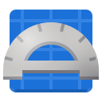

# Design 

2D CAD for the web 

Design is a 2D computer aided design application (CAD), 
created to meet the needs of makers and designers, 
hobbyists and professionals that require a first class 
CAD application. 
_________________________________________________________________________________________________________________

Design can be accessed at:
https://www.design-web.uk

Documentation is available at:
https://design-app.readthedocs.io/en/latest/index.html
_________________________________________________________________________________________________________________

Raspberry PI Schematics available from:
https://www.raspberrypi.org/documentation/hardware/raspberrypi/mechanical/README.md
_________________________________________________________________________________________________________________

Screenshots: 

_________________________________________________________________________________________________________________

Testing: npm start

Publishing: npm run deploy (updates publish branch on github)
_________________________________________________________________________________________________________________