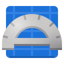
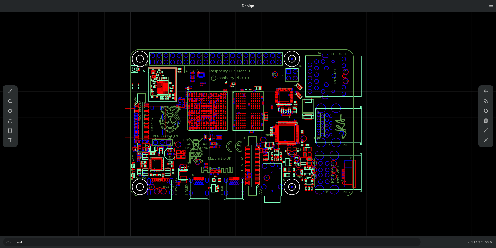
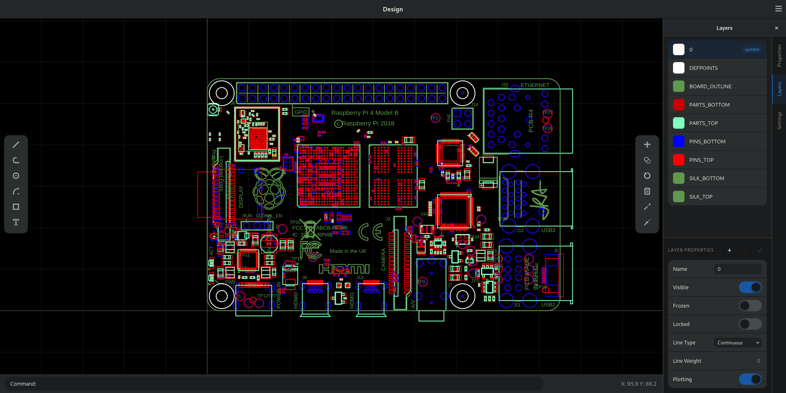
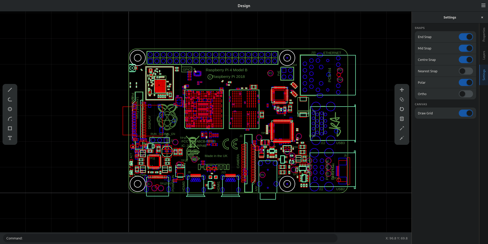
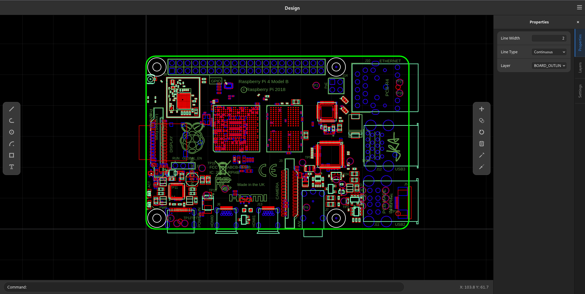

<div align="center">
  

  <h1>Design</h1>
  <p>A 2D CAD application for the web</p>

  <p>
    <a href="https://www.design-web.uk"></a>
    <a href="https://design-app.readthedocs.io/en/latest/index.html"></a>
    <a href="LICENSE"></a>
  </p>
</div>

---

## About

Design is a 2D computer-aided design (CAD) application built for the web, targeted at makers, designers, hobbyists, and professionals who need a capable CAD tool that runs entirely in the browser — no install required.

> **Try it now →** [design-web.uk](https://www.design-web.uk)

## Screenshots

<table>
  <tr>
    <td></td>
    <td></td>
    <td></td>
    <td></td>
  </tr>
</table>

## Getting Started

**Prerequisites:** [Node.js](https://nodejs.org/) 16+

```bash
# Clone the repository
git clone https://github.com/dubstar-04/Design-Web.git
cd Design-Web

# Install dependencies
npm install

# Start the development server
npm start
```

The app will be available at `http://localhost:3000`.

## Building & Deployment

```bash
# Create a production build
npm run build

# Deploy to GitHub Pages (production branch)
npm run deploy
```

## Documentation

Full documentation is available at [design-app.readthedocs.io](https://design-app.readthedocs.io/en/latest/index.html), covering commands, entities, and dimension styles.

## Contributing

Contributions are welcome. Please read [Contributing.md](Contributing.md) before opening a pull request.

## License

Distributed under the GPL-3.0 licence. See [LICENSE](LICENSE) for details.
